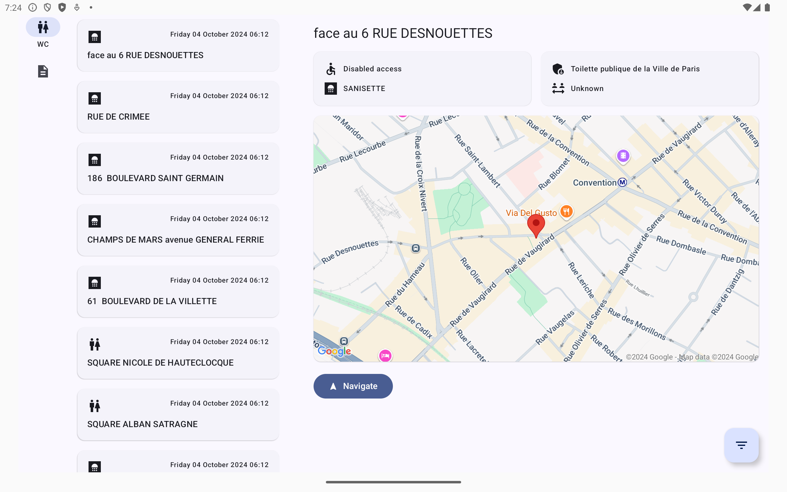

# B for Bank test

Test technical for B for Bank.

API chosen: https://data.ratp.fr/api/records/1.0/search/?dataset=sanisettesparis2011

## Lib used
- https://developer.android.com/topic/libraries/architecture/paging/v3-overview
- https://developer.android.com/jetpack/androidx/releases/compose-material3-adaptive
- https://developer.android.com/develop/ui/compose/layouts/adaptive/build-adaptive-navigation?hl=fr
- https://github.com/Kotlin/kotlinx.serialization
- https://github.com/Kotlin/kotlinx-datetime
- https://github.com/Kotlin/kotlinx.coroutines
- https://github.com/cashapp/turbine
- https://github.com/airbnb/lottie-android
- https://github.com/InsertKoinIO/koin
- https://github.com/googlemaps/android-maps-compose
- https://ktor.io/docs/client-create-new-application.html
- https://mockk.io/

### Tablet Support 

- On Menu
- On Filter

